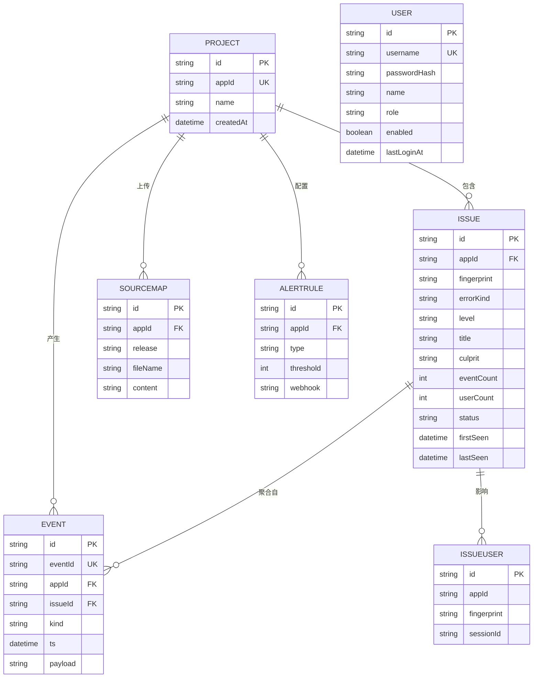
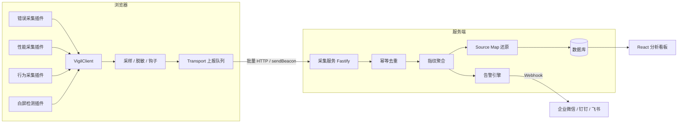
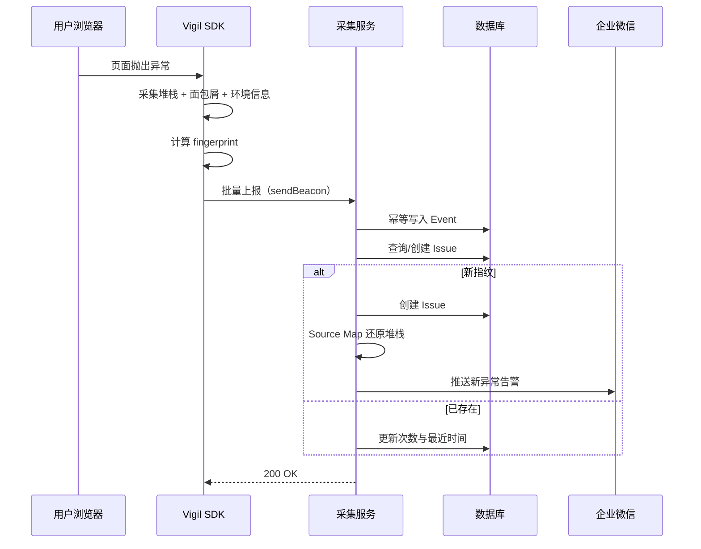

# Vigil 毕业设计材料

> 本文可直接用于：任务书、需求规格说明书、概要设计、数据库设计、答辩 PPT 的素材来源。
> 所有内容均基于当前代码实现核对，非虚构。

---

## 一、项目一句话定义

**Vigil 是一套可私有化部署的前端稳定性监控与诊断平台**，由浏览器端采集 SDK、数据接收与聚合服务、可视化分析看板三部分组成，用于解决 Web 应用线上异常发现滞后、定位困难、缺乏量化指标的问题。

---

## 二、需求分析

### 2.1 问题背景

| 现状问题 | 后果 |
| --- | --- |
| 线上异常依赖用户投诉才发现 | 止损滞后，业务损失扩大 |
| 生产代码压缩混淆，堆栈不可读 | 定位耗时长，排障成本高 |
| 错误日志量大且重复 | 真正的问题被淹没 |
| 页面性能靠主观感受 | 优化无依据，无法量化 |
| 第三方 SaaS 需数据外传 | 金融、政务等行业无法使用 |

### 2.2 功能性需求

| 编号 | 需求 |
| --- | --- |
| FR-01 | 系统应能采集页面 JS 运行时异常、未处理的 Promise 拒绝、资源加载失败 |
| FR-02 | 系统应能采集接口请求异常与慢请求 |
| FR-03 | 系统应能检测页面白屏 |
| FR-04 | 系统应能采集 Web Vitals 核心性能指标 |
| FR-05 | 系统应记录用户行为轨迹，异常发生时一并上报 |
| FR-06 | 系统应对上报数据进行采样、脱敏处理 |
| FR-07 | 系统应保证页面关闭场景下的数据不丢失 |
| FR-08 | 系统应将相似异常聚合为问题，并统计发生次数与影响用户数 |
| FR-09 | 系统应支持上传 Source Map 并将压缩堆栈还原至源码位置 |
| FR-10 | 系统应提供概览、问题列表、问题详情、性能分析四类可视化页面 |
| FR-11 | 系统应支持按状态、类型、关键字筛选问题 |
| FR-12 | 系统应支持配置告警规则并推送到企业 IM 工具 |
| FR-13 | 系统应支持多项目隔离管理 |
| FR-14 | 系统应能结合堆栈与用户行为轨迹，自动给出根因判断与修复建议 |
| FR-15 | 系统应在智能分析服务不可用时自动降级，保证诊断功能不中断 |
| FR-16 | 系统应提供用户登录与身份认证 |
| FR-17 | 系统应区分管理员与普通成员权限，管理员可管理用户账号 |

### 2.3 非功能性需求

| 类型 | 指标 |
| --- | --- |
| 性能 | SDK 产物 gzip 后 < 10KB，接入不影响宿主页面 |
| 可靠性 | 页面卸载场景下上报成功率 100%（sendBeacon 保障） |
| 安全性 | 敏感字段默认脱敏，支持私有化部署 |
| 兼容性 | 支持所有支持 PerformanceObserver 的现代浏览器，老浏览器自动降级 |
| 可用性 | 采集服务无状态，支持水平扩展 |

---

## 三、功能模块划分（8 大模块）

| 模块编号 | 模块名称 | 子功能 |
| --- | --- | --- |
| M1 | 数据采集模块 | 错误采集、性能采集、行为采集、白屏检测 |
| M2 | 数据上报模块 | 批量上报、采样、脱敏、Beacon 保障、失败重试、离线补报 |
| M3 | 数据接收与聚合模块 | 批量接收、幂等去重、指纹聚合、影响用户统计、自动建项目 |
| M4 | 堆栈还原模块 | Source Map 上传、堆栈解析还原、缓存、在线调试 |
| M5 | 可视化分析模块 | 概览看板、问题列表、问题详情、性能分析 |
| M6 | 项目管理与告警模块 | 项目 CRUD、告警规则 CRUD、Webhook 推送、问题状态流转 |
| M7 | AI 根因诊断模块 | 上下文组装、大模型分析、规则库兜底、结果缓存 |
| M8 | 用户与权限模块 | 登录认证、JWT 鉴权、修改密码、用户管理、角色区分 |

---

## 四、数据库设计（7 张表）

### 4.1 表清单

| 序号 | 表名 | 中文名 | 说明 |
| --- | --- | --- | --- |
| 1 | Project | 项目表 | 被监控的应用 |
| 2 | Issue | 问题表 | 按指纹聚合后的异常问题（核心表） |
| 3 | Event | 事件表 | 每一次原始上报的明细 |
| 4 | IssueUser | 影响用户表 | 用于精确统计影响用户数 |
| 5 | SourceMap | 映射文件表 | 存储上传的 Source Map |
| 6 | AlertRule | 告警规则表 | 告警配置 |
| 7 | User | 用户表 | 登录账号与角色权限 |

### 4.2 核心表结构

**Project（项目表）**

| 字段 | 类型 | 说明 |
| --- | --- | --- |
| id | String | 主键 |
| appId | String | 应用唯一标识（SDK 上报时使用） |
| name | String | 应用名称 |
| platform | String | 平台，默认 web |
| createdAt | DateTime | 创建时间 |

**Issue（问题表，核心）**

| 字段 | 类型 | 说明 |
| --- | --- | --- |
| id | String | 主键 |
| appId | String | 所属项目 |
| fingerprint | String | 错误指纹，与 appId 组成唯一键 |
| errorKind | String | 错误类型：js / promise / resource / http / whiteScreen |
| level | String | 等级：fatal / error / warning / info |
| title | String | 错误信息 |
| culprit | String | 定位到的源码位置 |
| stack | String | 还原后的堆栈 |
| eventCount | Int | 发生次数 |
| userCount | Int | 影响用户数 |
| status | String | unresolved / resolved / ignored |
| firstSeen | DateTime | 首次出现时间 |
| lastSeen | DateTime | 最近出现时间 |

**Event（事件表）**

| 字段 | 类型 | 说明 |
| --- | --- | --- |
| id | String | 主键 |
| eventId | String | 客户端事件 ID，唯一键，用于幂等去重 |
| appId | String | 所属项目 |
| kind | String | error / performance / behavior |
| ts | DateTime | 事件发生时间 |
| issueId | String | 关联的聚合问题 |
| fingerprint | String | 错误指纹 |
| errorKind / level | String | 错误维度 |
| perfName / perfValue / perfRating | String/Float/String | 性能维度 |
| release / environment | String | 版本与环境 |
| sessionId / userId | String | 会话与用户标识 |
| url / browser / os / device | String | 上下文维度 |
| payload | String | 完整事件体 JSON |

**IssueUser（影响用户表）**

| 字段 | 说明 |
| --- | --- |
| appId + fingerprint + sessionId | 三字段联合唯一，用于去重计数 |

**SourceMap（映射文件表）**

| 字段 | 说明 |
| --- | --- |
| appId + release + fileName | 联合唯一 |
| content | Source Map 文件内容 |

**AlertRule（告警规则表）**

| 字段 | 说明 |
| --- | --- |
| appId | 所属项目 |
| type | new_issue（新异常）/ error_spike（错误量突增） |
| threshold | 阈值（突增倍数） |
| webhook | 企业微信 / 钉钉 / 飞书机器人地址 |
| enabled | 是否启用 |

**User（用户表）**

| 字段 | 类型 | 说明 |
| --- | --- | --- |
| id | String | 主键 |
| username | String | 登录名，唯一 |
| passwordHash | String | scrypt 加盐哈希，格式 `salt:hash` |
| name | String | 显示名称 |
| role | String | admin（管理员）/ member（成员） |
| enabled | Boolean | 是否启用 |
| lastLoginAt | DateTime | 最近登录时间 |
| createdAt | DateTime | 创建时间 |

### 4.3 E-R 图



> 说明：`User` 为独立实体，用于系统登录与权限控制，与业务数据不直接关联。

---

## 五、系统架构图



## 六、核心时序图：异常从产生到告警



---

## 七、与现有产品的对比（原创性说明）

| 对比项 | Sentry | 阿里云 ARMS | **本系统 Vigil** |
| --- | --- | --- | --- |
| 部署方式 | SaaS / 自托管（重） | 仅 SaaS | **轻量私有化，Docker Compose 一键部署** |
| 技术栈 | Python + Django | 闭源 | **TypeScript + Fastify + Prisma + React** |
| SDK 体积 | 约 20KB+ | 约 15KB+ | **< 10KB gzip，插件化按需引入** |
| 告警渠道 | 邮件 / Slack | 阿里云生态 | **企业微信 / 钉钉 / 飞书，中文场景开箱可用** |
| 堆栈还原 | 支持 | 支持 | 支持，并提供在线调试接口 |
| AI 根因分析 | 商业版提供 | 部分提供 | **已实现：大模型分析 + 规则库兜底** |
| 用户与权限 | 团队/组织体系 | 依赖云账号 | **内置账号体系，管理员/成员两级角色** |
| 部署成本 | 高（多组件） | 无（SaaS） | **低：单进程服务 + 单数据库** |
| 适用规模 | 中大型团队 | 中大型团队 | **中小团队，运维成本极低** |

**原创性说明**：本系统在架构设计、技术选型、数据模型、算法实现上均为独立开发。
与上述产品的关系为"同一问题领域的不同实现"，可对比的差异点如上表所示。

---

## 八、创新点（供论文"创新点"章节使用）

1. **错误指纹聚合算法**：将错误类型、归一化消息（数字/哈希/引号内容泛化）、堆栈首帧三者组合哈希，在保证不误合并的前提下将海量上报压缩为有限问题集。
2. **上报可靠性三级保障**：批量与定时双触发减少请求数；`sendBeacon` 保障页面卸载场景；失败指数退避重试后落本地存储，下次启动补报。
3. **基于命中测试的白屏检测**：在视口取 9 个采样点做 `elementFromPoint` 命中测试，相比统计 DOM 节点数量的方案，能识别"存在 DOM 但不可见"的伪正常场景。
4. **AI 根因诊断**：将还原后的堆栈、源码定位、用户行为轨迹一并交给大模型，输出根因判断、修复建议与影响面评估，降低排障门槛；并在模型不可用时自动降级为规则库诊断，保证功能连续性。
5. **零依赖安全方案**：JWT 签发校验与密码加盐哈希全部基于 Node 内置 `crypto` 实现，避免引入第三方安全库带来的供应链风险与版本维护成本。

---

## 九、系统测试（供论文「第六章 系统测试」使用）

### 9.1 单元测试

| 项 | 说明 |
| --- | --- |
| 框架 | Node 内置 test runner（`node:test`）+ tsx，零新增依赖 |
| 覆盖对象 | 错误指纹聚合算法、敏感字段脱敏与采样、用户行为面包屑环形缓冲 |
| 用例文件 | `packages/sdk/tests/*.test.ts`（3 个文件，17 条用例） |
| 运行命令 | `npm test` |

核心模块覆盖率：

| 文件 | 行覆盖 | 分支覆盖 | 函数覆盖 |
| --- | --- | --- | --- |
| `core/fingerprint.ts` | 95% | 82% | 100% |
| `core/breadcrumb.ts` | 49% | 100% | 80% |
| `utils/index.ts` | 70% | 100% | 62% |

> breadcrumb.ts 未覆盖部分为依赖 DOM 的自动采集（document / window / history），须在浏览器环境运行，已说明未纳入单测范围。

### 9.2 Source Map 端到端验证

- 脚本：`scripts/sourcemap-demo.mjs`（`npm run sourcemap:demo`）
- 流程：esbuild 打包会抛错的源码 → 真实运行得到压缩堆栈 → 上传 `.map` → 调用还原接口 → 对比
- 实测结果：

```
还原前：at checkout (.../dist/app.cjs:27:16)
还原后：at checkout (../app.ts:8:15)
```

即压缩堆栈被精确定位回源码文件与行列号，证明还原链路正确可用。

### 9.3 部署验证

- 容器编排：`docker compose`（采集服务 / 看板 / PostgreSQL / Redis）
- 已通过 `docker compose config` 配置合法性校验
- 看板生产构建通过 `vite build` 验证，输出 `dist/` 静态资源

---

## 十、可选扩展（视老师要求而定）

| 扩展项 | 说明 | 工作量 |
| --- | --- | --- |
| 单元测试 | Vitest 覆盖 SDK 指纹算法与上报逻辑 | 1 天 |
| 压力测试报告 | 用 autocannon 压测上报接口，附 QPS 数据 | 半天 |
| 成员与项目关联 | 用户与项目绑定，支持按项目授权 | 半天 |
| 操作日志 | 记录谁在何时处理了哪个问题 | 半天 |

---

## 十一、论文推荐目录

```
第 1 章 绪论
  1.1 研究背景与意义
  1.2 国内外研究现状
  1.3 本文主要工作
第 2 章 相关技术
  2.1 TypeScript 与浏览器可观测性 API
  2.2 PerformanceObserver 与 Web Vitals
  2.3 Source Map 原理
  2.4 React / Fastify / Prisma
第 3 章 需求分析
  3.1 功能性需求    3.2 非功能性需求    3.3 可行性分析
第 4 章 系统设计
  4.1 总体架构      4.2 功能模块设计    4.3 数据库设计
  4.4 接口设计      4.5 关键算法设计（指纹 / 白屏 / 上报）
第 5 章 系统实现
  5.1 采集 SDK 实现      5.2 服务端实现
  5.3 AI 根因诊断实现    5.4 用户与权限实现
  5.5 前端看板实现
第 6 章 系统测试
  6.1 测试环境      6.2 功能测试        6.3 性能测试
第 7 章 总结与展望
参考文献
致谢
```
